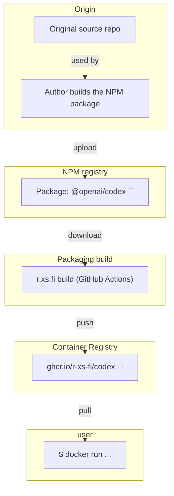

Container image for Codex - Lightweight coding agent that runs in your terminal

## Usage

### Start session

```shell
docker run --rm -it --privileged --volume=$(pwd):/workspace --volume=~/.codex:/root/.codex ghcr.io/r-xs-fi/codex 
```

Outputs:
```console
╭─────────────────────────────────────────────╮
│ >_ OpenAI Codex (v0.110.0)                  │
│                                             │
│ model:     gpt-5.3-codex   /model to change │
│ directory: /workspace                       │
╰─────────────────────────────────────────────╯
```

## Supported platforms


| OS    | Architecture  | Supported | Example hardware |
|-------|---------------|-----------|-------------|
| Linux | amd64 | ✅       | Regular PCs (also known as x64-64) |
| Linux | arm64 | ✅       | Raspberry Pi with 64-bit OS, other single-board computers, Apple M1 etc. |
| Linux | arm/v7 | ❌ (Upstream prebuild executable not available.)       | Raspberry Pi with 32-bit OS, older phones |
| Linux | riscv64 | ❌ (Upstream prebuild executable not available.)       | More exotic hardware |

## How does this software get to me?


